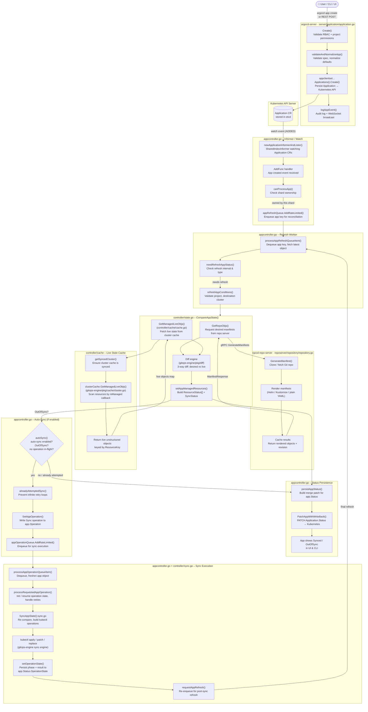

# CLAUDE.md

This file provides guidance to Claude Code (claude.ai/code) when working with code in this repository.

## Common Commands

All commands have `-local` variants that skip Docker (e.g., `make build-local`). Prefer the `-local` variants for local development.

### Build
```bash
make build-local          # Compile all Go binaries
make cli-local            # Build argocd CLI only
make build-ui             # Build React frontend (requires yarn)
```

### Lint
```bash
make lint-local           # Run golangci-lint on Go code
make lint-ui-local        # Run eslint/tsc on TypeScript/React code
```

### Test
```bash
make test-local           # Run all unit tests
make test-race-local      # Run with race detection

# Run tests for a specific package
go test github.com/argoproj/argo-cd/v3/controller/...

# Run a single test by name
go test github.com/argoproj/argo-cd/v3/controller -run TestMyFunction

# E2E tests (requires a running Kubernetes cluster)
make start-e2e-local      # Start all required servers (run in one terminal)
make test-e2e-local       # Run E2E tests (run in another terminal)

# Run a single E2E test
E2E_TEST_TIMEOUT=5m go test github.com/argoproj/argo-cd/v3/test/e2e -run TestMyE2EFunction -v
```

### Code Generation
```bash
make codegen-local        # Run all generators (protos, mocks, clients, OpenAPI)
make protogen-fast        # Regenerate proto/gRPC stubs only
make mockgen              # Regenerate test mocks
```

### Docker Image
```bash
# Build image for a specific arch (image tag defaults to latest when no git tag)
make image TARGET_ARCH=linux/amd64 IMAGE_TAG=my-dev-tag

# Push to a registry
make image TARGET_ARCH=linux/amd64 IMAGE_TAG=my-dev-tag DOCKER_PUSH=true IMAGE_NAMESPACE=myuser IMAGE_REGISTRY=ghcr.io
```

## Architecture

Argo CD is a set of cooperating microservices. The Go module is `github.com/argoproj/argo-cd/v3`. All binaries are compiled from a single `cmd/main.go` entrypoint that dispatches based on the binary name.

### Core Services

| Service | Source | Role |
|---|---|---|
| `argocd-server` | `cmd/argocd-server/`, `server/` | REST/gRPC API gateway; serves the UI |
| `argocd-application-controller` | `cmd/argocd-application-controller/`, `controller/` | Reconciles Application resources against live cluster state |
| `argocd-repo-server` | `cmd/argocd-repo-server/`, `reposerver/` | Clones Git repos and renders manifests (Helm, Kustomize, etc.) |
| `argocd-applicationset-controller` | `cmd/argocd-applicationset-controller/`, `applicationset/` | Manages ApplicationSet templating |
| `argocd-dex` | `cmd/argocd-dex/` | OIDC/SSO authentication proxy |
| `argocd-notification` | `cmd/argocd-notification/`, `notification_controller/` | Sends notifications on Application events |
| `argocd-cmp-server` | `cmd/argocd-cmp-server/`, `cmpserver/` | Config Management Plugin sidecar protocol |
| `argocd-commit-server` | `cmd/argocd-commit-server/`, `commitserver/` | Handles hydrator write-back commits |

### API Layer

The API server exposes a **gRPC** interface defined by `.proto` files in each service subdirectory (e.g., `server/application/application.proto`). **grpc-gateway** translates these to a REST/JSON API automatically. The server uses `cmux` to multiplex HTTP, gRPC, and gRPC-Web on a single port.

Key server packages under `server/`:
- `application/`, `applicationset/`, `project/`, `repository/`, `cluster/` — resource CRUD
- `session/` — authentication and token management
- `settings/` — system configuration
- `cache/` — Redis-backed response cache

### Application Controller

`controller/appcontroller.go` is the core reconciliation loop. It watches Kubernetes Applications, compares live cluster state to desired Git state (via the repo server), and applies diffs. Key sub-packages:
- `controller/cache/` — in-memory cluster resource cache; `ResourceInfo` struct carries per-resource metadata (AppName, health, networking)
- `controller/sharding/` — distributes Applications across multiple controller replicas
- `controller/hydrator/` — manages source hydration for commit-server write-back

State comparison happens in `controller/state.go:CompareAppState`. It calls `GetManagedLiveObjs` to retrieve live cluster state, `GetRepoObjs` to retrieve desired state from the repo server, runs a 3-way diff via `gitops-engine/pkg/diff`, and builds `Application.Status`.

Sync execution happens in `controller/sync.go:SyncAppState`. It re-runs `CompareAppState` to get a fresh `reconciliationResult` (Target + Live object pairs), then hands off to the gitops-engine sync engine which applies/patches/deletes resources.

### Repo Server

`reposerver/repository/repository.go` handles all Git operations: cloning, fetching, and rendering manifests. Results are cached (`reposerver/cache/`) to avoid redundant Git operations.

### gitops-engine (local module)

`gitops-engine/` is vendored as a local `replace` module in `go.mod`. It is **not** the published upstream package — changes here compile directly into Argo CD but do not affect any published version. Key packages:
- `gitops-engine/pkg/cache/` — `ClusterCache` maintains a watch-based in-memory mirror of cluster resources; `GetManagedLiveObjs` scans it with a caller-supplied `isManaged` callback
- `gitops-engine/pkg/sync/` — `Reconcile()` pairs target vs live objects; the sync engine applies the result
- `gitops-engine/pkg/diff/` — 3-way diff logic

### Resource Tracking

Argo CD tracks which resources belong to which Application using either a label (`app.kubernetes.io/instance`) or an annotation (`argocd.argoproj.io/tracking-id`), controlled by `trackingMethod` in settings. `util/argo/resource_tracking.go` implements `GetAppName` / `SetAppInstance`. The `ResourceInfo.AppName` field in `controller/cache/cache.go` is only populated for root resources (no `ownerReferences`); `TrackingAppName` is always populated when the tracking annotation is present regardless of ownerRefs.

### SyncOptions Extension Pattern

Application-level `spec.syncPolicy.syncOptions` entries are plain strings (`Key=value`). To add a new one:
1. Add a constant to `common/common.go` (e.g., `SyncOptionFoo = "Foo=true"`)
2. Read it wherever needed via `app.Spec.SyncPolicy.SyncOptions.HasOption(common.SyncOptionFoo)`
3. Document it in `docs/user-guide/sync-options.md`

### Frontend

The UI lives in `ui/` and is built with React + TypeScript + Webpack. Compiled assets are output to `ui/dist/app/` and served by the API server. Use `yarn` (not npm) for dependency management.

### Key Shared Packages

- `pkg/apis/application/v1alpha1/` — CRD type definitions (Application, AppProject, ApplicationSet)
- `util/argo/diff/` — diff configuration builder (`DiffConfigBuilder`); handles `ignoreDifferences`, resource overrides, normalizer opts, server-side diff
- `util/app/` — Application diff and comparison utilities
- `util/git/` — Git client abstraction
- `util/helm/` — Helm client integration
- `util/kube/` — Kubernetes client utilities
- `util/cache/` — Shared Redis cache client

### Data Flow Summary

1. User pushes to Git → Argo CD detects change via polling or webhook
2. **Repo server** clones the repo and renders manifests
3. **Application controller** compares rendered manifests to live Kubernetes state
4. Controller applies the diff (sync) or reports OutOfSync status
5. **API server** exposes Application status to CLI/UI

---

## Application Creation — Code Flow

The following diagram traces the full code path from `argocd app create` through reconciliation, comparison, and (optionally) auto-sync. Line numbers are approximate and may drift with code changes.



### Key call sites

| Phase | Function | File |
|---|---|---|
| API create | `Create` | `server/application/application.go` |
| Informer event | `AddFunc` handler | `controller/appcontroller.go` |
| Reconcile loop | `processAppRefreshQueueItem` | `controller/appcontroller.go` |
| Comparison | `CompareAppState` | `controller/state.go` |
| Repo manifests | `GenerateManifest` | `reposerver/repository/repository.go` |
| Live state | `GetManagedLiveObjs` | `controller/cache/cache.go` |
| Status write | `persistAppStatus` | `controller/appcontroller.go` |
| Auto-sync | `autoSync` | `controller/appcontroller.go` |
| Sync exec | `SyncAppState` | `controller/sync.go` |
